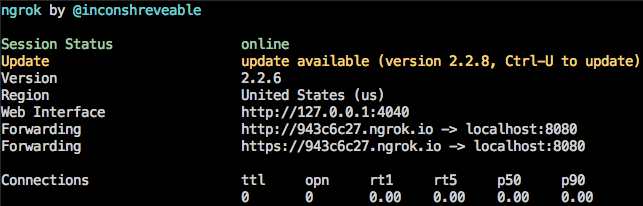

# Webhooks
Utility for drafting releases with merged PRs

## Features

### Pull Requests
- Listens for webhook events related to pull request events.
- Creates/edits releases to add merged pull requests.

## Getting Started

### Installation
Clone the repo and install dependencies

```bash
git clone git@github.com:yurm04/webhooks.git
cd webhooks
npm install
```

### Setup

#### Setup environment variables
There are a few environment variables that need to be set and exported before starting the node server:

- `GH_TOKEN`: The Github [personal access token](https://github.com/settings/tokens) to use for this app.  Used for authentication purposes.
- `SECRET`: The GitHub Webhook secret passed along with every Webhooks request.  Allows your app to authenticate the request and make sure the request is coming from a trusted source.  Pick a secure secret or create one using a [generator](https://randomkeygen.com/).
- `APP_NAME`: Name of the app to send as the `User-Agent` value in the API requests.
- `PORT` (optional): Set the port you want to connect to.  Defaults to port `8080` when not set.

To set these environment variables and spin up the node server, you can do one of two things:

- Add a `dev` script in the `package.json` file that exports the environment variables
- Create a bash file called `run_dev.sh` that exoprts the variables and is run using the `local` script in the `package.json` file (recommended).

##### Setup `package.json` script
Update the `dev` script in `package.json` to include the environment variables from above:

```bash
export GH_TOKEN="YOUR_TOKEN" APP_NAME="YOUR_APP" PORT="PORT_NUMBER"  nodemon --inspect ./index.js
```

To start the servers, run `npm run dev`.

##### Setup `run_dev.sh` script
Create a bash file called `run_dev.sh` in the `webhooks` root directory and substitute your values for the environment variables:

```bash
#!/bin/bash

export PORT="PORT_NUMBER" # optional
export GH_TOKEN="YOUR_TOKEN"
export APP_NAME="YOUR_APP"
export SECRET="YOUR_SECRET"
nodemon --inspect ./index.js
```

To start the server, run `npm run local`.

#### Download ngrok
To run and test the project locally, you'll need to set up [ngrok](https://ngrok.com) to securely expose your `localhost` to the GitHub Webhooks calls.

1. [Download ngrok](https://ngrok.com/download) and move the file to the `webhooks` directory.
2. Unzip the ngrok file `unzip ./ngrok-file-name.zip`.

### Start server
To start your enviroment for local testing, you'll need to first start ngrok and then the node server.

1. Run `./ngrok http :port_number:` with the `port_number` matching the one you set as the `PORT` environment variable or `8080` if none was specified.

    ```bash
    ./ngrok http 8081
    ```
2. Run `npm run dev` or `npm run local` based on which script you decided to setup from above.
3. If everything is set up correctly, your node server should be running, and you should see the ngrok console up and running in the window.
4. Make note of the ngrok "Forwarding" address (e.x `http://943c6c27.ngrok.io`) displayed in the console. We'll be using this to set up the Webhook in the repo settings.

**NOTE** The ngrok "Forwarding" address changes everytime ngrok is started, so you'll need to update it in the repo webhook settings every time you stop/start ngrok.



### Repo Webhooks Settings
With your local development environment set up, you can now set your repo up with the webhook information needed to communicate with the local environment.

1. From your repo page, click on the "Settings" tab.
2. On the left hand side, click the "Webhooks" menu item.
3. Click the "Add Webhook" button.
4. Add the ngrok "Forwarding" address to the "Payload URL" field with the `webhooks` path (e.x. `http://943c6c27.ngrok.io/webhooks`).
5. From the "Content Type" dropdown menu, select `application/json`.
6. Set the "Secret" field equal to the `SECRET` environment variable value created earlier.
7. Under "Which events would you like to trigger this webhook?" check off the "Let me select individual events."  This will expand the event options where you should select "Release" and "Pull Request."
8. Ensure that "Active" is checked off, and click "Add webhook" at the bottom of the form.
9. Celebrate :tada: You're now ready to start testing your webhook locally.
